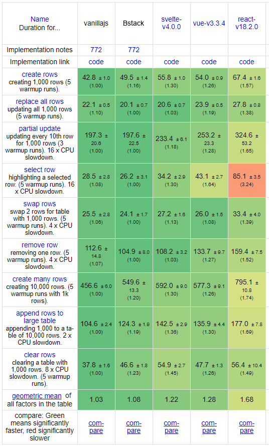
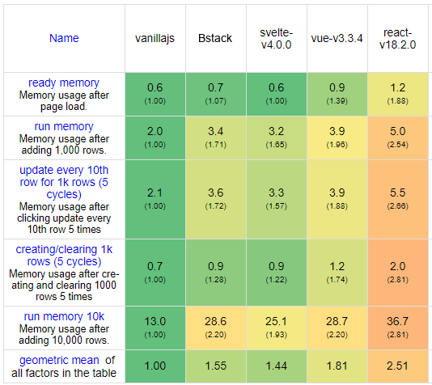

# Description

This is a project I started in June of 2023 because I thought it would be cool to have my own web dev stack and gain more insight to how these frameworks operated.

Currently, I am focusing on the frontend library, which is for building multi-page web applications. As of now, it supports CSR (client-side rendering) and SSG (static site generation), but I have plans to add SSR (server-side rendering) in the future. I also wish to create a more seemless dev experience with either JSX support (like Solid.js) or a custom compiled language (like Svelte), but I probably do not have that much time.

# Benchmarks

## Frontend

Anyways, here are some CSR benchmarks that I ran with my library using community-famed js-framework-benchmark by krausest.

Notes:
 - This only tests the CSR, state management, and reactivity features of the framework.
 - Because testing is quite time-cosuming, only the most popular frameworks are being compared against.
 - These are results for the for non-keyed frameworks/implementations as that is what my framework currently supports.
 - All tests were ran using node v18.13.0 and Chrome v116.0.5845.97.

### Performance: Duration in milliseconds ± 95% confidence interval (Slowdown = Duration / Fastest)

  

### Memory Usage: Memory allocation in MBs ± 95% confidence interval

  

Overall, I am quite happy with the performance. I did not expect to be beating Svelte and matching vanilla JS in performance, but even after multiple re-runs, the results remained the same. Memory usage is not quite at the same level, however, I do not seem to be too far off the mark from Svelte or Vue.

# Usage

## Features & Architecture

Bstack features a modern, portfolio-grade architecture designed for developer speed and execution efficiency:

* **Monorepo Workspaces**: Manages client, server, and playground components under a unified workspace. Setup requires only a single `npm install` at the root.
* **Bstack Developer CLI**: Run `npm run dev` at the root. It spins up the backend server, watches JSS files, and auto-rebuilds JSS templates and Rollup client bundles on the fly.
* **True Server-Side Rendering (SSR)**: Dynamic page resolution fetches request context and URL query parameters at runtime, dynamically instantiating page components and executing them on every request.
* **Live Reloading**: During development, the Node server clears the module require cache on request, reflecting layout and script edits instantly on browser refresh without restarting the server.
* **Microtask Reactivity Batching**: Client state updates are queued and flushed at the end of the microtask execution block (using a scheduler queue). Multiple synchronous state updates trigger only a single layout repaint, preventing DOM thrashing.

## Setup

To run development mode:

1. Clone the repo
2. Run `npm install` in the root directory (installs all workspace and CLI dependencies)
3. Run `npm run dev` at the project root to start the auto-compiling watcher and backend server.
4. Visit `http://localhost:8000`

Continue to replicate js-framework-benchmark tests:

1. Clone and follow the README of https://github.com/krausest/js-framework-benchmark. (Make sure to use Chrome v116 rather than v100)
2. Copy our folder `/benchmark-results/Bstack/`
    Note: This is a slight modification of `playground/dist/`
3. Paste the folder into krausest's `frameworks/non-keyed/`
4. Follow krausest's instructions for benching individual frameworks and compiling results into the tables seen above.

## Development Docs

These will be published once, and if, the stack is completed. For now, referring to the playground example should provide enough insight to create basic applications.
